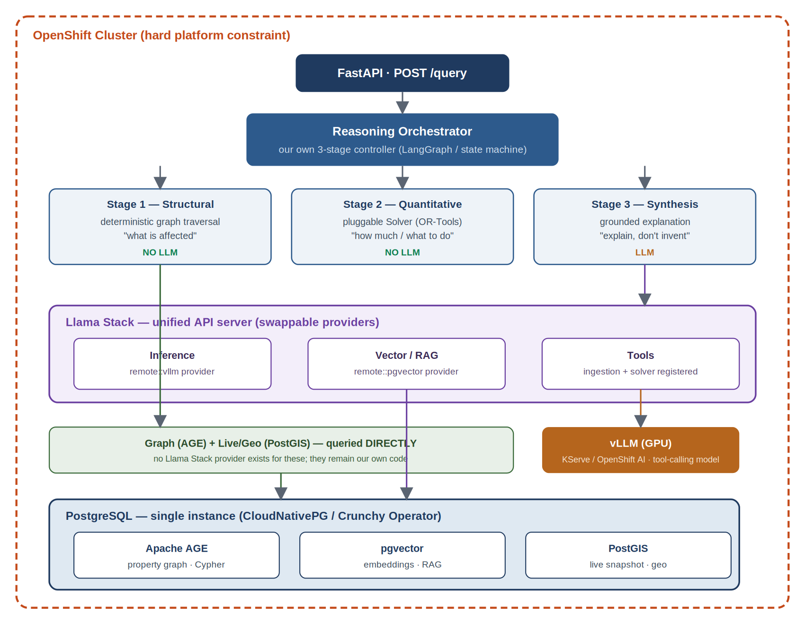
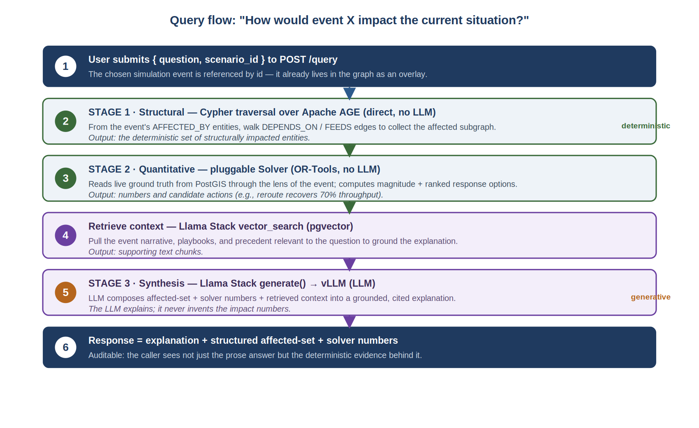
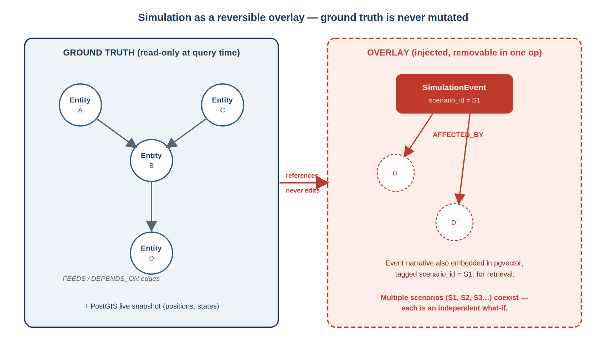
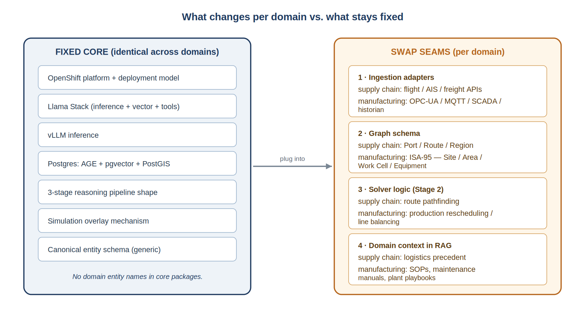

# General Simulation & Impact-Reasoning Platform (MVP)

A **domain-agnostic** simulation and impact-reasoning platform built on:

| Concern | Technology |
|---|---|
| Inference & embeddings | [Llama Stack](https://github.com/meta-llama/llama-stack) → vLLM (`remote::vllm`) |
| Vector / RAG | Llama Stack → pgvector (`remote::pgvector`) |
| Dependency graph | Apache AGE (Cypher), queried directly |
| Live / geo snapshot | PostGIS, queried directly |
| API | FastAPI |
| Dependency management | [uv](https://docs.astral.sh/uv/) |

> **Core design rule:** Live ground-truth data is **never mutated** by a simulation.
> Simulations are overlays applied at query time.

---

## Table of contents

- [What this platform does](#what-this-platform-does)
- [System at a glance](#system-at-a-glance)
- [The components and how they relate](#the-components-and-how-they-relate)
- [How a query flows through the system](#how-a-query-flows-through-the-system)
- [How the simulation actually works](#how-the-simulation-actually-works)
- [Why the same design serves multiple domains](#why-the-same-design-serves-multiple-domains)
- [Key decisions and risks to watch](#key-decisions-and-risks-to-watch)
- [Repository layout](#repository-layout)
- [Quickstart (local dev)](#quickstart-local-dev)
- [Running without hardware (CI / dev laptops)](#running-without-hardware-ci--dev-laptops)
- [Llama Stack — setup notes](#llama-stack--setup-notes)
- [OpenShift Deployment](#openshift-deployment)

---

## What this platform does

This system answers impact and response questions about a live operational environment when a disruptive event is layered on top of it. In plain terms: it takes a real-time picture of what is happening, overlays a hypothetical or unfolding disruption, and reasons over the combination to answer questions like *“how does this event affect the current situation?”* and *“how should things be rerouted or rescheduled in response?”*

The design is deliberately **domain-agnostic**. The original framing is a supply-chain scenario — a port closure or volcanic ash disrupting flights — but the same machinery applies unchanged to a manufacturing plant, where the disruption is a machine breakdown or material shortage. The core abstraction is the same in both: **live data + a dependency graph + a simulation-event overlay + staged reasoning.**

The whole platform is built to run on **OpenShift**, which is a hard constraint that shapes every technology choice below.

> **The one-sentence model:** A simulation event is an overlay that triggers a graph traversal to find what is affected, a solver to quantify it and compute responses, and an LLM to explain it — all read against a live snapshot that is never mutated.

---

## System at a glance

The platform is a small number of cooperating layers running inside one OpenShift cluster. The diagram below shows how they stack: an API and an orchestrator at the top, the three reasoning stages beneath, Llama Stack as the unified service backend, and a single Postgres instance holding all state. Two things are worth noticing immediately — the reasoning stages are colour-coded by whether they use the LLM, and the graph/geo path bypasses Llama Stack to talk to Postgres directly.



*Figure 1 — Layered system overview. Everything runs inside OpenShift. Llama Stack fronts inference and vector/RAG; graph (AGE) and live/geo (PostGIS) are queried directly because no Llama Stack provider exists for them.*

The remaining sections walk through each component: what it is, why it is there, and how it relates to its neighbours.

---

## The components and how they relate

### OpenShift — the platform

OpenShift is the deployment substrate and a fixed requirement, not an interchangeable choice. Every other component is selected partly because it runs cleanly on OpenShift: Postgres via an operator, vLLM via OpenShift AI / KServe, Llama Stack via its operator, and the application services as ordinary Deployments and CronJobs. Treating OpenShift as the constant is what lets the rest of the stack stay portable across domains.

### vLLM — local inference

vLLM serves the open-weight language model locally on GPU, so inference stays inside your cluster rather than calling an external API. It exposes an OpenAI-compatible interface, which is what allows it to sit behind Llama Stack as a standard provider. The single hard requirement on the model is that it must support **structured tool calling**, since the reasoning layer depends on it; in practice this also means starting vLLM with tool-calling enabled. This is one of the two main technical risks in the build.

### Llama Stack — the unified service backend

Llama Stack is a single API server with a swappable-provider architecture. It is the most consequential component in the design because it collapses three things that would otherwise be hand-written code into provider configuration: **inference** (a `remote::vllm` provider pointing at vLLM), **vector/RAG** (a `remote::pgvector` provider pointing at Postgres), and a **tool runtime** (where the ingestion adapters and the solver are registered as callable tools).

The important boundary to understand is what Llama Stack does **not** cover. There is no Llama Stack provider for graph traversal (Apache AGE) or for geospatial queries (PostGIS). Those remain the application’s own direct-to-Postgres code. So Llama Stack is the front door for inference, embeddings, vector search, and tools — but the deterministic graph and geo work sits beside it, not behind it.

> **Design rule:** Application code goes through the Llama Stack client (`src/llamastack`) for anything involving the model, embeddings, vector search, or registered tools — never calling vLLM or pgvector directly. The sole exceptions are graph (AGE) and live/geo (PostGIS), which have no provider and are queried directly.

### PostgreSQL — one database, three jobs

A single Postgres instance, managed by an operator (CloudNativePG or the Crunchy Postgres Operator), carries all persistent state through three extensions. Consolidating into one database keeps the OpenShift footprint small and means the graph, the embeddings, and the live snapshot can be correlated in one place.

| Extension | Role | Accessed via |
|---|---|---|
| **Apache AGE** | Property graph with openCypher. Holds the dependency graph and simulation-event overlays. Powers Stage 1. | Directly (no LS provider) |
| **pgvector** | Embeddings and RAG. Stores simulation-event narratives, playbooks, and precedent for retrieval. | Llama Stack vector provider |
| **PostGIS** | The live “current situation” snapshot — entity positions, states, geospatial data — written by ingestion. | Directly (no LS provider) |

Building a single custom Postgres image that bundles all three extensions is the **second main risk** in the build, and the plan front-loads it for that reason.

### Ingestion — getting live data in

Ingestion adapters pull from external sources and normalise whatever they return into a single **canonical schema** (id, type, optional geometry, timestamp, status, and a free-form attributes field). Each adapter knows one source; the normalisation step is what keeps the rest of the system source-agnostic. Adapters write **only** into the PostGIS live snapshot — they establish ground truth and never touch the simulation overlay.

Each adapter runs two ways: as a scheduled OpenShift CronJob for steady polling, and as an on-demand callable that is also registered as a Llama Stack tool, so the reasoning agent can trigger a fresh pull mid-query when it needs current data.

### The reasoning orchestrator and its three stages

A thin orchestrator (LangGraph or a plain state machine) owns the top-level flow. It deliberately keeps control rather than handing the whole query to Llama Stack’s agent loop, because two of the three stages are intentionally non-LLM and a generative agent loop would fight that structure. The three stages separate cleanly by responsibility:

- **Stage 1 — Structural (deterministic, no LLM):** a Cypher traversal over AGE that walks dependency edges from the event to find every structurally affected entity. Answers *what is affected.*
- **Stage 2 — Quantitative (solver, no LLM):** a pluggable solver (OR-Tools initially) that reads live state through the lens of the event and computes magnitude and ranked response options. Answers *how much, and what to do.*
- **Stage 3 — Synthesis (LLM):** the model takes the affected set, the solver’s numbers, and vector-retrieved context and produces a grounded, cited explanation. It *explains*; it never invents the impact numbers.

Keeping these three independently swappable is the heart of the design: the structural, quantitative, and explanatory concerns never blur into one another.

---

## How a query flows through the system

The diagram below traces a single question end to end. Notice that the deterministic stages (green) run before the generative one (orange), and that the final response carries the structured evidence alongside the prose so the answer is auditable rather than a black box.



*Figure 2 — The query lifecycle. Deterministic graph traversal and solver run first; the LLM synthesises last, grounded in their output.*

---

## How the simulation actually works

The most important architectural decision is that a simulation **never mutates live data**. A simulation event is an overlay applied at query time: it is a node injected into the graph, connected by `AFFECTED_BY` edges to the entities it perturbs, with its narrative embedded separately in the vector store. The live snapshot is read **through the lens of** that event, but is left untouched.

This is what makes multiple concurrent what-if scenarios trivial — each is an independent overlay tagged by its own scenario id — and what makes them fully reversible: removing the event node resets everything in a single operation.



*Figure 3 — The overlay mechanism. Ground truth (left) is read-only at query time. The event and its affected-entity references (right) are injected and removable, leaving the base graph intact.*

> **What kind of simulation this is (and isn’t):** This is a **dependency-and-impact reasoning** engine: it propagates effects through a known graph and applies solver logic on top. It is **not** a tick-by-tick discrete-event physics simulation (e.g. AnyLogic). That is an intentional trade: you gain explainability, speed, and concurrent what-if scenarios; you give up stochastic second-by-second temporal dynamics. Because the Stage 2 solver is pluggable, a full discrete-event engine can be dropped into that slot later without changing anything else.

---

## Why the same design serves multiple domains

The platform is best understood as a domain-agnostic skeleton with four well-defined swap points. The skeleton — OpenShift, Llama Stack, vLLM, Postgres, the three-stage pipeline, and the overlay mechanism — stays identical. Only four seams change when you move from supply chain to manufacturing.



*Figure 4 — The fixed core (left) versus the four per-domain swap seams (right). Domain adaptation touches only the right-hand column.*

The reason this works is that impact propagation is graph traversal in every domain. A port closure cascading through dependent routes and a stopped machine cascading through dependent cells are the **same** Cypher traversal over a **different** schema. The table below makes the mapping concrete.

| Layer | Supply chain | Manufacturing plant |
|---|---|---|
| Ingestion | Flight / AIS / freight APIs | OPC-UA, MQTT, SCADA, historian |
| Graph schema | Port, Route, Region | ISA-95: Site → Area → Work Cell → Equipment |
| Simulation event | Port closure, volcanic ash | Machine breakdown, material shortage |
| Solver (Stage 2) | Route pathfinding | Production rescheduling / line balancing |
| RAG context | Logistics precedent | SOPs, maintenance manuals, playbooks |

A manufacturing note worth flagging: plant sensor data is far higher-frequency than logistics data, so that domain leans harder on the historian/time-series side and may add a time-series extension or a downsampling step in ingestion. That is an ingestion-layer concern — it does not disturb the core.

---

## Key decisions and risks to watch

1. **One custom Postgres image** bundling AGE + pgvector + PostGIS is the linchpin; extension compatibility is the main setup risk, so build and test it first.
2. **The vLLM model must support structured tool calling**, with tool-calling enabled at serve time — validate this before committing, since the reasoning layer depends on it.
3. **Keep the orchestrator separate from Llama Stack’s agent loop.** The deterministic stages must not be forced into a generative agent loop.
4. **Graph and geo stay direct-to-Postgres.** Don’t expect Llama Stack to be a single front door for all state — it owns inference, vector, and tools only.
5. **Live data and simulation knowledge stay separate.** The overlay must never mutate ground truth; this is what enables concurrent, reversible what-if scenarios.

> In short: a fixed OpenShift-native skeleton handles platform, inference, storage, and reasoning identically across domains, while four narrow seams — ingestion, graph schema, solver, and RAG context — are all that change to retarget it from supply chains to manufacturing plants.

---

## Repository layout

```
src/
  core/        # Domain-agnostic abstractions, interfaces, and Settings
  ingestion/   # Ingestion agent framework + adapters (registered as Llama Stack tools)
  graph/       # AGE graph access (Cypher) — direct to Postgres
  live/        # PostGIS live snapshot store — direct to Postgres
  reasoning/   # 3-stage pipeline: traversal → solver → synthesis
  solver/      # Pluggable quantitative solver interface + stub impl
  llamastack/  # Llama Stack client wrapper + run.yaml provider config
  api/         # FastAPI entrypoint
deploy/        # Containerfiles, OpenShift manifests, LlamaStackDistribution CR
tests/
```

---

## Quickstart (local dev)

### 1. Install dependencies

```bash
uv sync --all-extras
```

### 2. Configure environment

```bash
cp .env.example .env
# Edit .env with your Postgres DSN and Llama Stack base URL
```

### 3. Run the API

```bash
uv run python -m src.api.main
# or:
uv run uvicorn src.api.app:app --reload
```

Visit `http://localhost:8000/health` — returns `{"status": "ok", "db": "reachable"}` when
Postgres is available.

### 4. Run tests (no GPU or live Llama Stack required)

```bash
uv run pytest
```

---

## Running without hardware (CI / dev laptops)

Set `USE_FAKE_LLAMA_STACK=true` in `.env` (or the environment).  This swaps in
`FakeLlamaStackClient` which returns canned completions, embeddings, and vector
search hits, so the full reasoning pipeline can be exercised in tests without a
GPU or a running Llama Stack server.

---

## Llama Stack — setup notes

### vLLM tool-calling requirement

vLLM **must** be started with `--enable-auto-tool-choice` and a matching
`--tool-call-parser` for structured tool calls to work through Llama Stack:

```bash
vllm serve meta-llama/Llama-3.1-8B-Instruct \
    --enable-auto-tool-choice \
    --tool-call-parser hermes   # or: llama3_json, mistral, internlm2
```

The correct parser depends on the model family.  Without this flag, tool calls
will fail silently or produce plain-text invocations that Llama Stack cannot
parse.

> **Key risk:** the generation model must support *structured* tool calling with
> a JSON schema.  Llama-3 8B/70B Instruct, Mistral Instruct v0.3+, and Hermes
> variants are known to work.  Base (non-Instruct) models and many fine-tunes
> do **not**.

### Pointing run.yaml at a local vLLM for dev

1. Start vLLM locally (with the flags above).
2. Set `VLLM_URL=http://localhost:8080` and `PGVECTOR_*` vars matching your
   compose Postgres.
3. Run the Llama Stack server:

```bash
llama stack build --config deploy/llamastack/build.yaml
llama stack run deploy/llamastack/run.yaml
```

The app's `LLAMA_STACK_BASE_URL` should point at this server (default
`http://localhost:8321`).

### Using the fake client (no GPU, no Llama Stack server)

Set `USE_FAKE_LLAMA_STACK=true` in `.env`.  `FakeLlamaStackClient` provides:
- Deterministic embeddings (hash-seeded unit vectors, correct dimension)
- In-memory vector store (ingest then search, cosine similarity)
- Canned generation responses (configurable tool-call shape for pipeline tests)

---

## OpenShift Deployment

All manifests live under `deploy/openshift/`.  Follow the steps below in order;
each step must succeed before the next one starts.

### Prerequisites

| Requirement | Notes |
|---|---|
| OpenShift 4.13+ | Tested against OCP 4.14/4.15 |
| `oc` CLI logged in | `oc login ...` with cluster-admin or a role that can create all resource types below |
| GPU nodes | Required for vLLM only; CPU nodes sufficient for everything else |
| NVIDIA GPU Operator | Install via OperatorHub if using the plain vLLM Deployment |
| CloudNativePG operator | See step 2 |
| (Optional) Red Hat OpenShift AI | Required only for the KServe `InferenceService` vLLM path |
| Podman / Docker | To build and push images |

---

### Step 1 — Create the namespace

```bash
oc apply -f deploy/openshift/namespace.yaml
oc project general-sim
```

---

### Step 2 — Install the CloudNativePG operator

```bash
# Install CNPG cluster-wide (requires cluster-admin)
oc apply -f https://raw.githubusercontent.com/cloudnative-pg/cloudnative-pg/release-1.24/releases/cnpg-1.24.0.yaml

# Wait for the operator to be ready
oc rollout status deployment/cnpg-controller-manager -n cnpg-system --timeout=120s
```

---

### Step 3 — Apply secrets and ConfigMaps

> **Important:** Replace every `REPLACE_ME` value in `shared/secrets.yaml`
> before applying.  Never commit real secrets.

```bash
# Edit secrets first
vi deploy/openshift/shared/secrets.yaml

oc apply -f deploy/openshift/shared/secrets.yaml
oc apply -f deploy/openshift/shared/configmaps.yaml
```

---

### Step 4 — Build and push images

#### Custom Postgres (CloudNativePG-compatible)

```bash
# Log in to the internal registry
oc registry login

podman build \
  -f deploy/postgres/Containerfile.cnpg \
  -t image-registry.openshift-image-registry.svc:5000/general-sim/general-sim-postgres:latest \
  deploy/postgres

podman push \
  image-registry.openshift-image-registry.svc:5000/general-sim/general-sim-postgres:latest
```

#### FastAPI application

```bash
podman build \
  -f deploy/app/Containerfile \
  -t image-registry.openshift-image-registry.svc:5000/general-sim/general-sim-app:latest \
  .

podman push \
  image-registry.openshift-image-registry.svc:5000/general-sim/general-sim-app:latest
```

#### Llama Stack distribution

```bash
# Build the Llama Stack distribution image from the provider config
llama stack build --config deploy/llamastack/build.yaml

podman tag distribution-general-sim:dev \
  image-registry.openshift-image-registry.svc:5000/general-sim/llamastack-general-sim:latest

podman push \
  image-registry.openshift-image-registry.svc:5000/general-sim/llamastack-general-sim:latest
```

---

### Step 5 — Deploy Postgres

```bash
oc apply -f deploy/openshift/postgres/cluster.yaml

# Wait until the primary instance is ready (can take 2-3 minutes on first run
# because the custom image compiles AGE and pgvector)
oc wait cluster/general-sim-postgres \
  -n general-sim \
  --for=condition=Ready \
  --timeout=300s
```

---

### Step 6 — Run the schema bootstrap Job

```bash
oc apply -f deploy/openshift/bootstrap/job.yaml

oc wait job/general-sim-bootstrap \
  -n general-sim \
  --for=condition=complete \
  --timeout=120s

# Inspect logs if the Job fails
oc logs job/general-sim-bootstrap -n general-sim
```

---

### Step 7 — Deploy vLLM

**Option A — Plain Deployment** (works on any GPU-enabled OpenShift):

```bash
# Edit deployment.yaml to set the correct model path on the PVC
oc apply -f deploy/openshift/vllm/deployment.yaml

oc rollout status deployment/vllm -n general-sim --timeout=300s
```

**Option B — KServe InferenceService** (requires OpenShift AI / RHOAI):

```bash
# Edit inferenceservice.yaml to set storageUri and confirm the ServingRuntime name
oc apply -f deploy/openshift/vllm/inferenceservice.yaml
```

Verify vLLM is serving before proceeding:

```bash
oc exec -n general-sim deployment/vllm -- \
  curl -s http://localhost:8080/health
```

> **Reminder:** vLLM must be started with `--enable-auto-tool-choice` and
> `--tool-call-parser=llama3_json` (or the appropriate parser for your model).
> Tool calling through Llama Stack will silently fail without these flags.

---

### Step 8 — Deploy Llama Stack

```bash
oc apply -f deploy/openshift/llamastack/deployment.yaml

oc rollout status deployment/llamastack -n general-sim --timeout=120s

# Confirm the server started and connected to vLLM + pgvector
oc logs deployment/llamastack -n general-sim | tail -20
```

---

### Step 9 — Deploy the API

```bash
oc apply -f deploy/openshift/api/deployment.yaml
oc apply -f deploy/openshift/api/service.yaml
oc apply -f deploy/openshift/api/route.yaml

oc rollout status deployment/general-sim-api -n general-sim --timeout=60s

# Get the external Route URL
oc get route general-sim-api -n general-sim -o jsonpath='{.spec.host}'
```

Smoke test:

```bash
ROUTE=$(oc get route general-sim-api -n general-sim -o jsonpath='{.spec.host}')
curl -s https://$ROUTE/health | jq .
# Expected: {"status": "ok", "db": "reachable"}
```

---

### Step 10 — Create the ingestion CronJob

```bash
oc apply -f deploy/openshift/ingestion/cronjob.yaml

# Trigger a manual run immediately to verify
oc create job general-sim-ingestion-manual \
  --from=cronjob/general-sim-ingestion \
  -n general-sim

oc wait job/general-sim-ingestion-manual \
  -n general-sim \
  --for=condition=complete \
  --timeout=120s
```

---

### Deploy order summary

```
Step 1  namespace.yaml
Step 2  Install CloudNativePG operator
Step 3  shared/secrets.yaml + shared/configmaps.yaml
Step 4  Build & push: general-sim-postgres, general-sim-app, llamastack-general-sim
Step 5  postgres/cluster.yaml  →  wait Ready
Step 6  bootstrap/job.yaml     →  wait complete
Step 7  vllm/deployment.yaml (or vllm/inferenceservice.yaml)  →  verify /health
Step 8  llamastack/deployment.yaml  →  verify logs
Step 9  api/deployment.yaml + api/service.yaml + api/route.yaml  →  smoke-test /health
Step 10 ingestion/cronjob.yaml  →  trigger manual run
```

### In-cluster service FQDNs

| Service | URL |
|---|---|
| Postgres primary (R/W) | `general-sim-postgres-rw.general-sim.svc:5432` |
| vLLM | `http://vllm.general-sim.svc:8080` |
| Llama Stack | `http://llamastack.general-sim.svc:8321` |
| API | `http://general-sim-api.general-sim.svc:8000` |

---

See `deploy/openshift/` for the full manifest set and `deploy/app/Containerfile` /
`deploy/postgres/Containerfile.cnpg` for the container build instructions.
